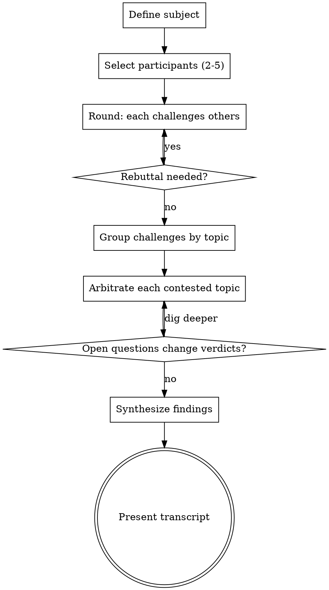

# Agentic Debate

A structured adversarial reasoning technique for high-stakes decisions. Multiple named perspectives challenge each other across rounds, contested topics are arbitrated, and findings are synthesized into a verdict.

Use this when listing pros/cons is not enough — when the stakes are high enough that a single perspective could miss critical blind spots.

<HARD-GATE>
Do NOT reach a conclusion or recommend an approach until arbitration is complete for all contested topics. Every participant must have had a chance to challenge at least one other participant before arbitration begins.
</HARD-GATE>

## When to Use

- Comparing 2+ competing architectures, designs, or strategies
- Technical decisions with significant long-term consequences
- When the user asks to "debate", "stress-test", or "challenge" an approach
- When a prior recommendation was challenged or felt one-sided

**NOT for:** Open-ended exploration or ideation (use brainstorming instead). Debate assumes there are defined positions that can conflict.

## Checklist

You MUST create a task for each of these items and complete them in order:

1. **Define the subject** — one-sentence statement of what is being decided
2. **Select participants** — 2–5 named perspectives with distinct, conflicting stakes
3. **Run challenge rounds** — each participant challenges others on specific named topics
4. **Group by topic** — cluster challenges; mark contested vs uncontested
5. **Arbitrate each contested topic** — verdict with confidence level and rationale
6. **Synthesize** — recommendation that integrates the strongest points from all sides
7. **Present transcript** — structured output to user with open questions

## Process Flow



## The Process

### 1. Define the Subject

One sentence. The specific decision, question, or proposal under examination.

> "Subject: Whether to adopt a microservices architecture for the payments system."

### 2. Select Participants

2–5 named perspectives with genuinely conflicting stakes. These are roles or lenses, not real people.

**Good participants:** `performance` · `maintainability` · `security` · `cost` · `operability` · `developer-experience` · `short-term` · `long-term` · `user-needs` · `business-risk`

**Rule:** If two participants would always agree, merge them. Every participant must have a stake that could conflict with at least one other.

### 3. Run Challenge Rounds

Each participant challenges at least one other on a specific, named topic. A valid challenge must:

* Name the topic explicitly (`topic: "data_consistency"`)
* State what position it contests
* Give a concrete argument
* Declare confidence: **high** / **medium** / **low**

```text
[Round 1]
performance → maintainability  |  topic: deployment_complexity
  "Microservices introduce distributed tracing overhead that monoliths avoid.
   Teams spend substantial debug time on network issues that don't exist locally."
  confidence: high

maintainability → performance  |  topic: deployment_complexity
  "Monolith coupling forces coordinated deploys that block independent team velocity.
   At scale, this becomes the bottleneck, not network overhead."
  confidence: medium
```

Run Round 2 if any challenge was met with a credible counter-argument that materially changes the picture.

### 4. Group by Topic

Cluster all challenges under shared topic labels. Topics with challenges from multiple participants are **contested**; single-challenger topics are **uncontested**.

### 5. Arbitrate Each Contested Topic

For each contested topic:

```text
topic: deployment_complexity
  winner: performance  |  confidence: moderate (65%)
  rationale: Distributed tracing overhead is real; tooling has improved but the
             operational burden is non-trivial for smaller teams.
  open_question: What is the current team size and target deployment frequency?
```

Confidence levels:

* **Strong** (>75%): one side's argument is clearly better-evidenced
* **Moderate** (60–75%): one side leads but the other raises valid conditions
* **Contested** (<60%): genuinely depends on unknowns — surface the open questions

### 6. Synthesize

2–4 sentences that:

1. State the overall recommendation, or explain why no clear winner exists
2. Acknowledge the strongest dissenting point
3. List conditions under which the verdict reverses
4. Call out open questions that must be resolved before committing

### 7. Present Transcript

Use this structure:

```text
## Debate: <subject>

### Participants
- <id>: <one-line stance>

### Challenge Rounds
[formatted rounds]

### Verdicts by Topic
[arbitration for each contested topic]

### Synthesis
[recommendation + strongest dissent + reversal conditions]

### Open Questions
[what would change these verdicts]
```

## Key Principles

* **Adversarial by design** — participants must challenge, not just list alternatives from their corner
* **Named topics are required** — vague challenges cannot be arbitrated; name the specific tension
* **Confidence is explicit** — never leave it implicit; it drives arbitration weight
* **Synthesis transcends sides** — the conclusion integrates the strongest points from all participants
* **Open questions belong in the output** — unresolved questions are findings, not failures
